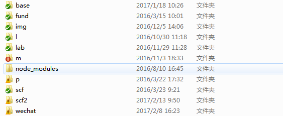
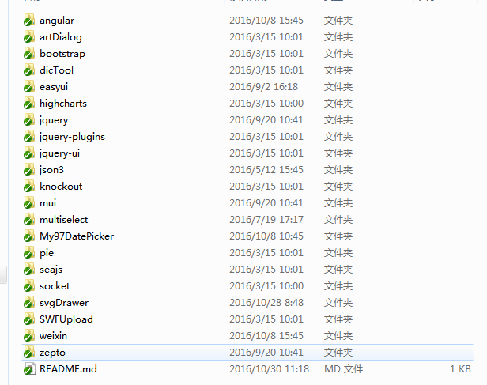
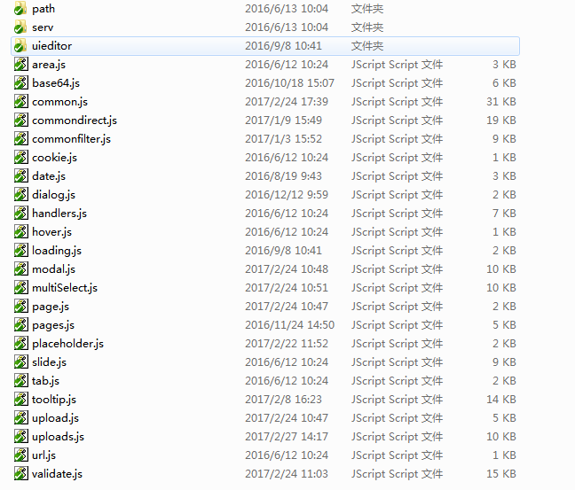

<link rel="stylesheet" href="http://yandex.st/highlightjs/8.0/styles/github.min.css">

## 系统架构
[TOC]
>1. 对项目主要文件、文件夹的功能描述
>2. 供应链2.0 组件库的介绍(btdev)，组件详细使用看组件文档介绍
#### 一. 项目结构
  

#### 二. 项目主要文件夹
|文件夹     |描述                       |
|:-|:-|
|base       |基础配置文件 (定义别名、预加载类库等)|
|l          |类库 (jquery、angular等)   |
|m          |自定义组件、服务、过滤器   |
|p          |基金项目代码                   |
|scf        |供应链金融代码 (v1.0)          |
|scf2       |供应链金融代码 (v2.0及以上)    |
|wechat     |供应链金融代码 (微信端)        |

#### 三. 项目主要脚本介绍
|文件名     |描述                       |
|:-|:-|
|Gruntfile.js               |grunt 任务配置与自定义任务，监听依赖于该文件|
|package.json               |grunt 定义依赖的包文件     |
|打开p分支Sass监听.bat      |监听基金项目sass文件，生成css |
|打开Sass监听.bat           |监听供应链2.0 sass文件，生成css |
|打开wechat_Sass监听.bat    |监听微信项目sass文件，生成css   |
|微信项目webpack监听.bat    |监听微信项目js，自动合并、压缩  |

#### 四. 项目详细
##### 1 基础配置 /base
|文件            |描述功能                          | 使用
|:-|:-|:-:|
|config.js       |预加载 knockout、jquery、json3    |基金项目使用
|config_ng.js    |预加载 angular、jquery、json3     |供应链金融项目使用(PC端)

##### 2 类库介绍 /l
<!--    -->

|文件夹        |描述                         |
|:-|:-|
|angular       |双向绑定等，项目主要                |
|bootstrap     |样式                            |
|easyui        |权限模块，配置菜单用到tree      |
|highcharts    |----                   |
|jquery        |基础类库        |
|json3         |现代json实现，兼容老式浏览器    |
|knockout      |基金项目用到，新项目中已被angular取代     |
|mui           |微信端框架，提供组件（单选，日期，面板等）|
|multiselect   |下拉多选               |
|My97DatePicker|日期               |
|seajs         |包管理               |
|weixin        |微信开发用到，调用微信接口，如上传等       |

##### 3 自定义组件、服务、过滤器   /m

> 供应链2.0主要组件介绍 ( btdev目录下 )
<!--    -->

|文件名        |描述                         |
|:-|:-|
|path (文件夹)           |内commonpath文件，配置请求路径   |
|serv (文件夹)           |内commonservice文件，配置公用服务(发送请求，缓存等)|
|uieditor (文件夹)       |在线编辑器(百度)               |
|base64         |base64压缩，解压            |
|common         |公用基础方法        |
|commondirect   |公用指令    |
|commonfilter   |公用过滤器(数字，金额等)    |
|date           |日期组件   |
|dialog         |弹出框组件  
|loading        |遮罩层组件  
|modal          |面板，模板组件  
|multiSelect    |下拉多选               |
|pages          |表格分页组件             |
|placeholder    |使低版本IE支持placeholder属性(对type为password的不支持)|
|tooltip        |消息提示组件(如成功时弹出提示)       |
|uploads        |文件上传组件    
|validate       |校验组件，定义校验规则和方法。    

##### 4 供应链2.0工程文件 /scf2
|文件夹        |描述                         |
|:-|:-|
|template      |SPA结构，存放html模板  |
|controller    |SPA结构，存放js文件，路由路径配置文件route.js也在此|
|views         |非SPA结构，存放html文件   |
|js            |非SPA结构，存放js文件  |
|sass          |存放sass文件           |
|css           |存放css文件            |
|img           |存放图片等             |
|testdata      |测试假数据，包括本地测试菜单配置 navtree.json|

|文件           |描述   |
|:-|:-|
|flow.html      |SPA主页(流程相关)
|flow.js        |引用js  
|home.html      |SPA主页            |
|home.js        |引用js             |

##### 5 微信wechat工程文件 /wechat
|文件夹        |描述                         |
|:-|:-|
|views         |存放html模板  |
|js            |存放js文件，内含路由配置|
|flowScript    |存放js文件（流程相关），内含路由配置|
|sass          |存放sass文件           |
|css           |存放css文件            |
|img           |存放页面所需图片       |
|testdata      |测试假数据             |

|文件           |描述   |
|:-|:-|
|index.html     |SPA主页            |
|index.js       |引用js             |
|flow.html      |SPA主页(流程相关)  |
|flow.js        |引用js             |

