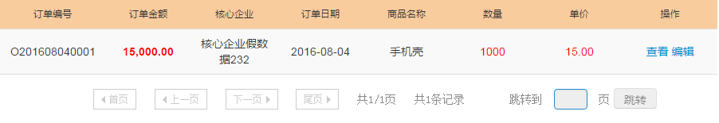

<link rel="stylesheet" href="http://yandex.st/highlightjs/8.0/styles/github.min.css">
<script src="http://yandex.st/highlightjs/8.0/highlight.min.js"></script>
<script>hljs.initHighlightingOnLoad();</script>


## 1.PC端分页组件（bt-pagination）
>conf 属性接收分页参数对象
>func 属性定义刷新方法

#### 示例
##### 调用函数配置
```javascript
//引入文件
var pages = require("pages");
//引用模块 pagination
var mainApp = angular.module('mainApp',['pagination','modal','upload','date']);
//定义分页参数对象
$scope.listPage = {
    pageNum: 1,     //当前页
    pageSize: 10,   //页面显示条目
    pages: 1,       //总页数
    total: 1        //数据总数
};

//重新从第一页加载数据
$scope.searchList = function(){
    $scope.listPage.pageNum = 1;
    $scope.queryList(true);//调用刷新方法，传入 true
};

//定义刷新方法，刷新表格数据
//flag 参数，页面初始化或从首页重新加载，传入true,否则为false
$scope.queryList = function(flag){
    $scope.listPage.flag = flag? 1 : 2;
    http.post(BTPATH.QUERY_LIST_ORDER,$.extend({},$scope.listPage,$scope.searchData)).success(function(data){
            //判断数据非空
            if(common.isCurrentData(data)){
                $scope.$apply(function(){
                    $scope.infoList = common.cloneArrayDeep(data.data);
                    if(flag){
                        $scope.listPage = data.page;
                    }
                });
            }   
    });
};

```

##### 页面调用
```html
 <!-- 用于表格底部-->
 <tfoot>
    <td colspan="8">
      <!-- 传入false参数 -->
      <div bt-pagination conf="listPage" func="queryList(false);"></div>
    </td>
  </tfoot>
```


##### 样式引入
```css
 <!-- 引入文件 -->
 @import "common/pages";
 
 <!-- 引入 Spage_plugin mixin -->
 #container{
   @include Spage_plugin;
 }
```

##### 效果图
  
  