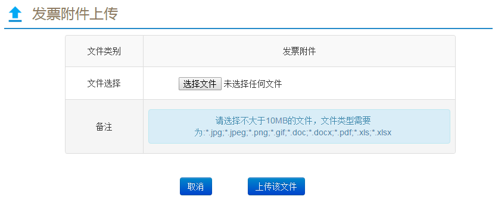
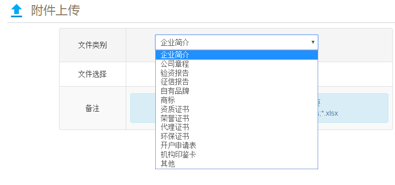

<link rel="stylesheet" href="http://yandex.st/highlightjs/8.0/styles/github.min.css">
<script src="http://yandex.st/highlightjs/8.0/highlight.min.js"></script>
<script>hljs.initHighlightingOnLoad();</script>


## 1.上传组件（bt-upload）
>conf属性接收参数对象，下表为参数列表

##### 参数列表
| 参数      |取值                |描述                    |是否必填  |默认值|
|-|:-:|-|:-:|:-:|
|event      |----                |上传触发元素            |是        |-
|type       |----                |上传附件类型            |是        |-
|typeName   |----                |附件类型名称            |否        |-
|typeList   |----                |列表，定义附件类型      |否        |-
|uploadList |----                |列表，存放上传文件      |是        |-
|showTitle  |true/false          |是否显示标题            |否        |true
|prompt     |'note'/'slide'      |错误提示方式(弹出/下滑) |否        |'note'  


#### 示例1 (单附件类型)
##### 调用函数配置
```javascript
//引入文件
var upload = require("upload");
//引用模块 upload
var mainApp = angular.module('mainApp',['pagination','modal','upload','date']);
//开启上传
$scope.openUpload = function(event,type,typeName,list){
    $scope.uploadConf = {
        //上传触发元素
        event:event.target||event.srcElement,
        //上传附件类型
        type:type,
        //类型名称
        typeName:typeName,
        //存放上传文件
        uploadList:$scope[list]
    };
};
```

##### 页面调用
```html
<!-- 组件引入 -->
<div bt-upload conf="uploadConf" ></div>
<!-- 上传调用 -->
<button class="btn btn-info" type="button" 
        ng-click="openUpload($event,'otherInfoFile','发票附件','invoiceAttach')">上传附件
</button>
```

##### 效果图
  
  


#### 示例2 (多附件类型-下拉选择)
##### 调用函数配置
```javascript
//引入文件
var upload = require("upload");
//引用模块 upload
var mainApp = angular.module('mainApp',['pagination','modal','upload','date']);
//开启上传(下拉选择附件)
$scope.openUploadDropdown = function(event,typeList,list){
      $scope.uploadConf = {
        //上传触发元素
        event:event.target||event.srcElement,
        //附件类型列表
        typeList:$scope[typeList],
        //存放上传文件
        uploadList:$scope[list]
        
      };
};
```


##### 页面调用
```html
<!-- 组件引入 -->
<div bt-upload conf="uploadConf" ></div>
<!-- 上传调用 -->
<button class="btn btn-info btn-right" ng-click="openUploadDropdown($event,'basicAttachTypes','basicUploadList');">+新增附件</button>
```

##### 效果图
    
